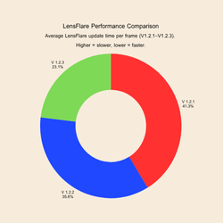

# 🌟 LensFlare System

A **customizable and optimized Lens Flare System** for Roblox, built upon the original work by [@gluGPU](https://devforum.roblox.com/u/glugpu/summary).  
This modified version adds new features, fixes, and performance improvements for modern visual scripting and rendering.


---

## 📥 Installation

To download LensFlare, go to the [**Releases**](https://github.com/PyreX09/LensFlare/releases) page.


---

## ⚙️ Features

✅ Full **OOP System** for lens flare control  
✅ **Dynamic color blending** based on object color and attributes  
✅ Built-in **LOD (Level of Detail)** support for optimization  
✅ **Raycast-based visibility detection** for realistic light occlusion  
✅ Simple API — create and destroy flares with just a few lines  
✅ Designed for **Cameras, Attachments, or Parts**

---

## 📊 Performance Comparison

LensFlare Frame Time Across Versions

This project includes performance profiling for LensFlare updates per frame across versions 1.2.1 to 1.2.3 using Roblox Studio MicroProfiler.

### Average Frame Time per Version


- Donut Chart: Shows the average update time per frame for each version.
	- Higher values → slower performance
	- Lower values → faster performance


- Stacked Line Chart: Shows frame-by-frame timing for LensFlare updates across versions.

	- X-axis: Frame Number
	- Y-axis: Frame Time (ms)

---

## 🚀 Usage Example

```lua
local on = false

script.Parent.Activated:Connect(function()
	if not on then
		on = true
		script.Parent.Light.Shadow.Enabled = true
		script.Parent.Light.Light.Enabled = true
		script.Parent.Light.Sound:Play()
		script.Parent.Front.SurfaceLight.Enabled = true
		
		script.Parent.LensFlare:SetAttribute("LensFlareDistance", 100)
		script.Parent.LensFlare:SetAttribute("LensFlareLOD", 1)
		script.Parent.LensFlare:SetAttribute("LensFlareStrength", 0.75)
		script.Parent.LensFlare:SetAttribute("LensFlareStyle", "Default")

	else
		on = false
		script.Parent.Light.Shadow.Enabled = false
		script.Parent.Light.Light.Enabled = false
		script.Parent.Light.Sound2:Play()
		script.Parent.Front.SurfaceLight.Enabled = false
		
		script.Parent.LensFlare:SetAttribute("LensFlareDistance", 0)
		script.Parent.LensFlare:SetAttribute("LensFlareLOD", 0)
		script.Parent.LensFlare:SetAttribute("LensFlareStrength", 0)
		script.Parent.LensFlare:SetAttribute("LensFlareStyle", "Default")
	end
end)
```

---

## 🧠 Developer Notes

Each flare runs on a render step bind, optimized to reduce redundant updates.

Uses cached attributes and properties for minimal overhead.

Built for first-person and cinematic scenes, tested up to 120 FPS, maybe.

---

## 👑 Special Thanks

[@gluGPU](https://devforum.roblox.com/u/glugpu/summary) : Creator of [LensFlare](https://create.roblox.com/store/asset/89532403908041/Lens-Flare-System) a system that I have spent countless hours modifying.

---

## ❓ Q&A (Extended)

### Q: How do I add a light to myself?
**A:** Do it like this 👇

1. **Add the Tag:** `LensFlare` to the object you want to have the flare effect.  
2. **Add the following Attributes:**
   - `LensFlareDistance`
   - `LensFlareLOD`
   - `LensFlareStrength`
   - `LensFlareStyle`
3. You can **set the values according to the example model in Workspace**, or tweak them yourself as you like.

---

### Q: What is `NUMBER_OF_RAYCASTS`?
**A:** This determines how many rays are shot to detect flare obstruction.  
- Lower values → faster performance, less accurate occlusion.  
- Higher values → slower performance, more precise flare visibility.

---

### Q: What does `RAYCAST_RADIUS` do?
**A:** It spreads out the rays around the flare source. Doesn’t affect performance, just changes flare obstruction detection area.

---

### Q: How does `TRANSPARENCY_THRESHOLD` work?
**A:** Parts more transparent than this value won’t block lens flares.  
- 1 → even fully transparent parts block flares.  
- 0 → only opaque parts block flares.

---

### Q: How is sun flare strength determined?
**A:** Sun flare is based on:
- `SUN_ANGLE_THRESHOLD` → angle above horizon to start fading  
- `SUN_BRIGHTNESS_THRESHOLD` → Lighting.Brightness value for full strength  
- `SUN_EXPOSURE_ADJUSTMENT` → exposure change when looking directly at sun  
- `SUN_EXPOSURE_TIME` → duration of smooth exposure adjustment  

---

### Q: What is `LensFlareDistance`?
**A:** This is the **default maximum distance** at which a flare is visible.  
- Used when `LOD_ENABLED = false`.  
- Flare disappears if the camera is farther than this value.  
- Think of it as the **“always use this distance”** setting.

---

### Q: What does `LensFlareLOD` affect?
**A:** `LensFlareLOD` is a **multiplier for `LOD_SCALE`** used **when `LOD_ENABLED = true`**.  
- Maximum visible distance = `LOD_SCALE × LensFlareLOD`  
- Example:  
  - `LOD_SCALE = 200`  
  - `LensFlareLOD = 3`  
  - Maximum visible distance = 200 × 3 = 600 studs  
- Also affects **dynamic raycount & flare fading** based on distance.  

---

### Q: What is MIN_RAY_RATIO?
**A:** The minimum ratio of rays to keep during LOD adaptive scaling.
- Ensures that even at low FPS or far distances, at least this portion of rays are cast.
- Value between 0 and 1 (e.g., 0.2 → 20% of NUMBER_OF_RAYCASTS).

---

### Q: What is TARGET_FPS?
**A:** Desired framerate for adaptive LOD calculation.
- System adjusts ray count to keep performance near this FPS.
- Lower FPS than target → fewer rays → better performance.
- Higher FPS than target → more rays → better quality.

---

### Q: What is FPS_SAMPLE_COUNT?
**A:** Number of frames to average for FPS calculation.
- Higher value → smoother FPS estimation, slower reaction to sudden frame drops.
- Lower value → reacts quickly, but FPS value fluctuates more.

---

### ⚡ TL;DR Comparison

| Setting                    | Used when    | Determines                       | Notes                                                          |
| -------------------------- | ------------ | -------------------------------- | -------------------------------------------------------------- |
| `LensFlareDistance`        | LOD_DISABLED | Max flare distance               | Default distance, flare always visible within this range       |
| `LensFlareLOD × LOD_SCALE` | LOD_ENABLED  | Max flare distance & dynamic LOD | Adjusts rays & fade, overrides LensFlareDistance for LOD logic |

---

### Q: What is `LensFlareStrength`?
**A:** Determines how visible/bright a flare is.  
- 0 → invisible  
- 1 → full brightness  

---

### Q: How does the system handle dynamic raycasts?
**A:** If LOD is enabled, the number of rays is recalculated based on distance.  
- Closer → more rays → accurate obstruction  
- Farther → fewer rays → performance optimized  

---

### Q: Can I make a sun lens flare?
**A:** The system already **creates the sun flare automatically**.  
It handles position, strength, and exposure based on Lighting and camera for you.  
You only need to mess with it if you wanna tweak the sun flare manually.

---

### Q: How does debug mode work?
**A:**  
If `DEBUG_MODE = true`, the console prints:
- Part name  
- Flare alpha  
- Number of rays hitting  
- Distance to camera  
- LOD recalculations  
- Re-emission events  
- FPS

It’s useful for tweaking flare behavior during development.
